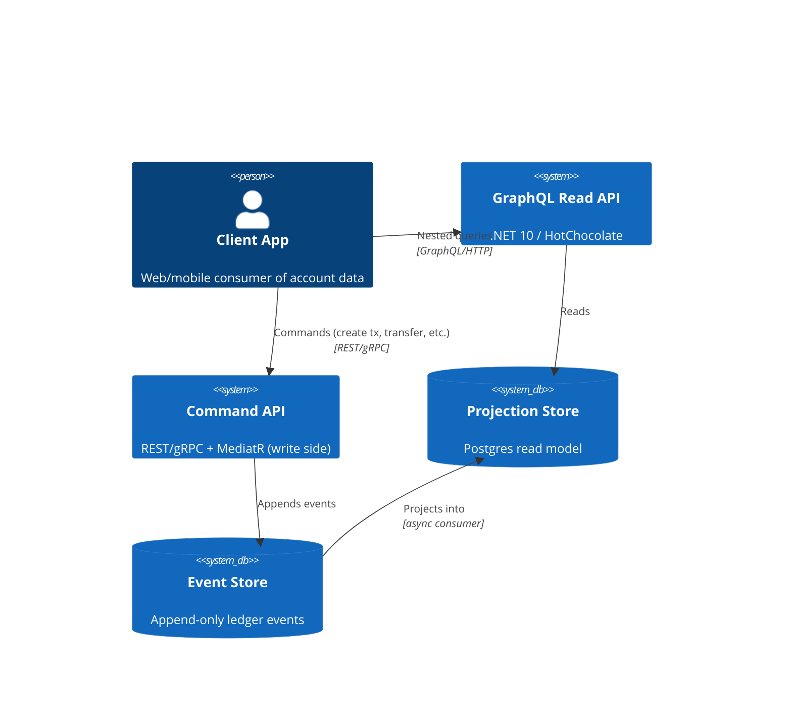
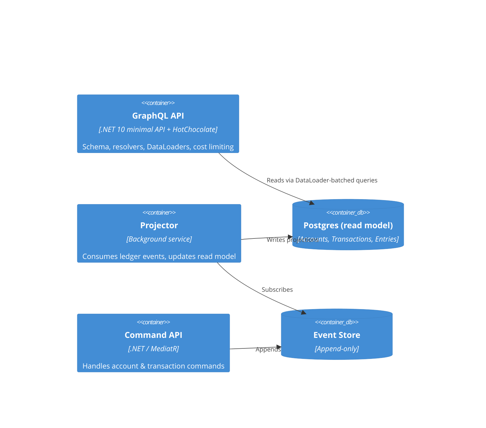
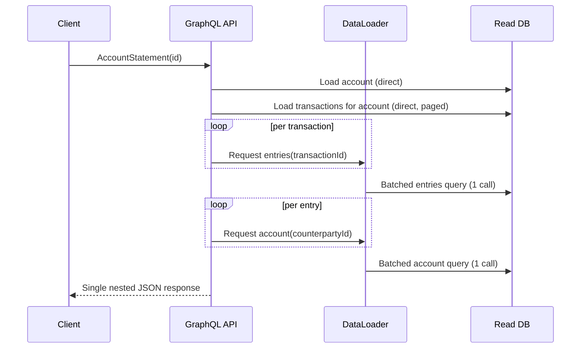

# Architecture — CQRS Read-Side via GraphQL (.NET 10)

## 1. System context (C4 — Level 1)



The command side and query side are physically separate processes. The GraphQL API **never writes** — it only resolves queries against the projection store. This is the core CQRS boundary, and it's worth stating explicitly because it's the thing that keeps the GraphQL layer simple: no mutations to reason about, no write-conflict handling, no schema coupling to command validation.

## 2. Containers (C4 — Level 2)



## 3. Domain shape

```
Account
 ├─ id, name, balance
 └─ transactions: [Transaction]
       ├─ id, postedAt, description
       └─ entries: [Entry]
             ├─ amount, direction (debit/credit)
             └─ counterpartyAccount: Account   ← cycles back into the graph
```

This is the detail that motivates the whole demo: the domain is not a flat table, it's a **graph with a cycle** (entry → counterparty account → that account's own transactions). REST forces you to flatten this into a fixed set of endpoints and either over-fetch (embed everything, even when the client only needs balances) or under-fetch (return IDs and make the client chase them). GraphQL lets the client describe the exact subgraph it needs, and lets the server resolve it in one pass.

## 4. Why GraphQL here — the nested-data argument

### 4.1 The query a client actually wants

```graphql
query AccountStatement($id: ID!) {
  account(id: $id) {
    name
    balance
    transactions(first: 20) {
      postedAt
      description
      entries {
        amount
        direction
        counterpartyAccount {
          name
        }
      }
    }
  }
}
```

One request. The shape of the response mirrors the shape of the domain exactly — no client-side stitching.

### 4.2 The same view via REST

| Step | Call | Why it's needed |
|---|---|---|
| 1 | `GET /accounts/{id}` | Account name + balance |
| 2 | `GET /accounts/{id}/transactions?limit=20` | Transaction list |
| 3 | `GET /transactions/{id}/entries` × 20 | Entries per transaction (unless the API pre-embeds them, which then over-fetches for every *other* consumer that doesn't need entries) |
| 4 | `GET /accounts/{counterpartyId}` × (entries count) | Counterparty names |

Even with a generous REST design that embeds transactions and entries in step 1–2, the counterparty lookups (step 4) are unavoidable without either denormalizing counterparty names into every entry (data duplication, staleness risk) or accepting N further round trips. This is the client-side N+1 problem — GraphQL doesn't just move this problem to the server, it lets a **single resolver graph with DataLoader batching** solve it once, in one place, for every consumer.

### 4.3 Comparison summary

| | REST (fixed endpoints) | GraphQL (this design) |
|---|---|---|
| Round trips for the statement view | 3–22+ depending on design | 1 |
| Over-fetching for consumers that only need balance | Likely (if entries are embedded by default) | None — client selects fields |
| Under-fetching (client must chase IDs) | Likely (counterparties) | None — nested selection resolves it |
| Where N+1 is solved | Client, if at all | Server, once, via DataLoader |
| Schema evolution | New endpoint or version per new shape | New field, additive, no versioning |
| Query shape control | Server decides | Client decides, server bounds cost |

The benchmark in the repo should reproduce this table with real numbers (request counts, payload bytes, p50/p95 latency) rather than leaving it as an assertion.

## 5. DataLoader batching (the mechanism behind the win)

Without batching, resolving `entries.counterpartyAccount` for 20 transactions × ~2 entries each issues ~40 individual lookups — a server-side N+1, just moved one layer down. HotChocolate's DataLoader collapses same-tick requests for the same entity type into one batched query:

```csharp
public class AccountByIdDataLoader : BatchDataLoader<Guid, Account>
{
    private readonly IDbContextFactory<ReadDbContext> _dbFactory;

    public AccountByIdDataLoader(
        IDbContextFactory<ReadDbContext> dbFactory,
        IBatchScheduler batchScheduler,
        DataLoaderOptions options)
        : base(batchScheduler, options)
        => _dbFactory = dbFactory;

    protected override async Task<IReadOnlyDictionary<Guid, Account>> LoadBatchAsync(
        IReadOnlyList<Guid> ids, CancellationToken ct)
    {
        await using var db = _dbFactory.CreateDbContext();
        return await db.Accounts
            .Where(a => ids.Contains(a.Id))
            .ToDictionaryAsync(a => a.Id, ct);
    }
}
```

The demo should log/assert the actual query count before and after wiring this in — that before/after number is the single most convincing artifact for anyone reviewing the repo, more so than the diagrams.

## 6. Production safeguards

A nested, client-driven query language is also an attack surface if left unbounded. This demo includes:

- **Depth limiting** — reject queries nested beyond a configured depth (prevents the `entries.counterpartyAccount.transactions.entries...` cycle from being abused).
- **Query cost analysis** — HotChocolate's cost directive assigns weights to fields/lists; requests over a cost budget are rejected before execution.
- **Persisted queries** — production clients send a query hash, not raw GraphQL text; the server only executes pre-registered queries. This closes off arbitrary ad-hoc queries against a production read model while keeping the nested-query benefit for known client views.
- **Field-level authorization** — e.g., `balance` and `counterpartyAccount` may require different claims than `name`/`description`; HotChocolate authorization directives enforce this per field, not just per endpoint.

## 7. Sequence — resolving a nested query



## 8. ADRs to include in the repo

- **ADR-001**: Use GraphQL for the read side only; write side remains REST/gRPC + MediatR.
- **ADR-002**: DataLoader batching over N+1-prone naive resolvers.
- **ADR-003**: Persisted queries + cost limiting over unrestricted ad-hoc querying, for production posture.
- **ADR-004**: Why federation/gateway (schema stitching across services) is explicitly out of scope for this demo — single bounded context doesn't need it, and introducing it here would dilute the read-side argument this demo is making.
- **ADR-005**: Nitro (Banana Cake Pop successor) as the GraphQL API documentation surface — bundled IDE on a dev-only route, no extra package.

## 9. Honest trade-offs (worth stating out loud)

- GraphQL adds a resolver/schema layer that a simple flat REST endpoint wouldn't need — it earns its cost specifically because the domain is nested, not by default.
- Caching is harder than REST's HTTP-cache-by-URL model; this demo leans on persisted queries partly to make response caching by query-hash feasible again.
- A junior team without prior GraphQL exposure has a real ramp-up cost (DataLoader semantics, N+1 debugging, schema design discipline) — worth naming in interview discussion as a genuine trade-off, not glossing over it.
